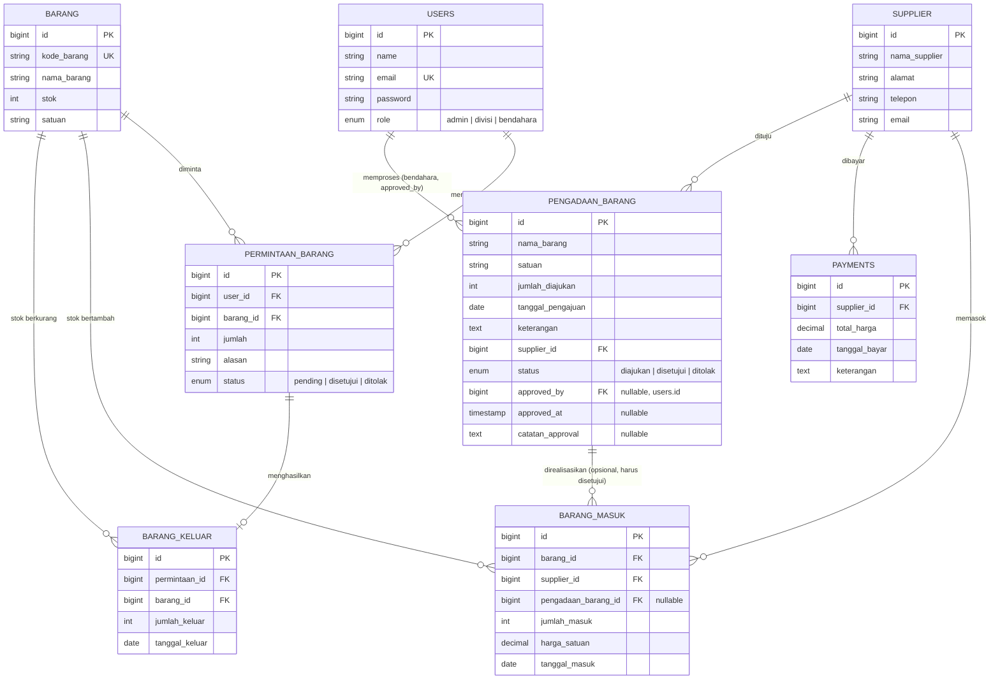

# ATK Laravel — Sistem Manajemen Inventaris & Pengadaan Barang

Aplikasi berbasis web untuk mengelola stok barang (ATK/inventaris), pencatatan barang masuk & keluar, supplier, pembayaran, pengadaan barang dengan alur **persetujuan anggaran oleh bendahara**, serta alur permintaan barang antar-divisi dengan sistem persetujuan (approval). Dibangun dengan **Laravel 11**.

---

## Daftar Isi

1. [Fitur Utama](#1-fitur-utama)
2. [Teknologi yang Digunakan](#2-teknologi-yang-digunakan)
3. [Arsitektur & Cara Kerja Aplikasi](#3-arsitektur--cara-kerja-aplikasi)
4. [Struktur Basis Data & ERD](#4-struktur-basis-data--erd)
5. [Instalasi](#5-instalasi)
6. [Konfigurasi Setelah Clone](#6-konfigurasi-setelah-clone)
7. [Menjalankan Aplikasi](#7-menjalankan-aplikasi)
8. [Akun Default (Seeder)](#8-akun-default-seeder)
9. [Panduan Penggunaan Aplikasi](#9-panduan-penggunaan-aplikasi)
10. [Struktur Folder Proyek](#10-struktur-folder-proyek)
11. [Troubleshooting Umum](#11-troubleshooting-umum)
12. [Metodologi Pengembangan: SDLC dengan Pendekatan Agile](#12-metodologi-pengembangan-sdlc-dengan-pendekatan-agile)

---

## 1. Fitur Utama

**Untuk role Admin:**
- Dashboard admin
- Manajemen data barang (CRUD) + cetak daftar barang ke PDF
- Pencatatan barang masuk (dari supplier) + cetak PDF — **opsional dikaitkan ke pengajuan Pengadaan Barang yang sudah disetujui bendahara**, dengan validasi jumlah tidak boleh melebihi sisa yang disetujui
- Pencatatan barang keluar (hasil approval permintaan divisi) + cetak PDF
- Manajemen data supplier (CRUD)
- Manajemen pembayaran ke supplier, termasuk cetak invoice PDF
- Pengadaan barang: pengajuan kebutuhan barang ke supplier, dikelompokkan per supplier & tanggal, cetak PDF per item maupun per kelompok — **setiap pengajuan wajib melalui persetujuan bendahara** sebelum bisa direalisasikan jadi Barang Masuk; pengajuan yang sudah diproses (disetujui/ditolak) tidak bisa diedit/dihapus lagi
- Kelola permintaan barang dari seluruh divisi: **approve / reject**, dikelompokkan per tanggal
- Manajemen akun user divisi (CRUD)
- Manajemen akun user bendahara (CRUD)
- Pengaturan akun admin (ubah nama/password)

**Untuk role Divisi:**
- Dashboard divisi
- Mengajukan permintaan barang ke admin
- Melihat status permintaan (pending / disetujui / ditolak), dikelompokkan per tanggal
- Pengaturan akun sendiri (ubah nama/password)

**Untuk role Bendahara** *(baru)*:
- Dashboard ringkasan pengajuan pengadaan yang menunggu tindakan
- **Menyetujui / menolak** setiap pengajuan Pengadaan Barang dari admin — penolakan wajib disertai catatan/alasan
- Melihat riwayat seluruh pengajuan (filter per status: diajukan / disetujui / ditolak) beserta siapa yang memprosesnya dan kapan
- Pengaturan akun sendiri (ubah nama/password)

> Kenapa perlu role bendahara? Sebelumnya, Pengadaan Barang dan Barang Masuk adalah dua catatan yang **sama sekali tidak terhubung** — admin bisa mencatat barang masuk (stok bertambah) tanpa dasar pengajuan/persetujuan apa pun, sehingga tidak ada jejak audit maupun kontrol siapa yang mengizinkan pembelian. Role bendahara menutup celah ini: pemisahan tanggung jawab antara yang **mengajukan** (admin) dan yang **mengotorisasi** (bendahara), sekaligus barang masuk yang dikaitkan ke pengadaan divalidasi jumlahnya agar tidak melebihi yang disetujui.

**Autentikasi & Otorisasi:**
- Login dengan email & password
- **Lupa password via OTP email** — user meminta kode OTP 6 digit yang dikirim ke email terdaftar, verifikasi kode, lalu set password baru (lihat [Panduan Penggunaan](#lupa-password-otp))
- Middleware berbasis role (`admin`, `divisi`, dan `bendahara`) — setiap grup route hanya bisa diakses oleh role yang sesuai, akses tanpa izin akan mendapat HTTP 403

---

## 2. Teknologi yang Digunakan

| Komponen | Teknologi |
|---|---|
| Backend Framework | Laravel 11 (PHP ^8.2) |
| Database | MySQL (default XAMPP) — testing otomatis pakai SQLite in-memory |
| Frontend Build | Vite + Tailwind CSS, template admin berbasis Bootstrap |
| Template Engine | Blade |
| PDF Generator | `barryvdh/laravel-dompdf` |
| Rendering HTML→PDF alternatif | `spatie/browsershot` (butuh Node.js + Puppeteer/Chrome jika dipakai) |
| Monitoring Kesehatan App | `spatie/laravel-health` |
| Pengiriman Email (OTP) | Laravel Mail (SMTP, contoh: Mailtrap untuk testing) |
| Testing | PHPUnit (Feature test, `RefreshDatabase` + SQLite in-memory) |
| Code Quality | Laravel Pint, PHPStan (Larastan), Enlightn |

---

## 3. Arsitektur & Cara Kerja Aplikasi

Aplikasi ini menggunakan pola **MVC (Model-View-Controller)** standar Laravel:

- **Model** (`app/Models`) — representasi tabel database & relasi antar data (Eloquent ORM).
- **Controller** (`app/Http/Controllers`) — logika bisnis, menangani request dan mengembalikan view/response.
- **View** (`resources/views`) — tampilan Blade, dipisah per modul (`admin/`, `divisi/`, `bendahara/`, `barang/`, `payment/`, `login/`, `emails/`, dst).

### Alur Request

```
Browser -> routes/web.php -> Middleware (auth + role) -> Controller -> Model (Eloquent/MySQL) -> View (Blade) -> Response
```

### Alur Kerja Bisnis (Business Flow)

**A. Alur Pengadaan Barang -> Persetujuan Bendahara -> Barang Masuk** *(alur utama, direvisi)*
```
1. Admin membuat pengajuan Pengadaan Barang (nama barang, jumlah, satuan, supplier tujuan)
      -> status default: "diajukan"
      -> dikelompokkan per Supplier + tanggal pengajuan, bisa dicetak PDF sebagai dokumen ke supplier

2. Bendahara login, meninjau daftar pengajuan yang "diajukan"
      -> Setujui  -> status jadi "disetujui" (tercatat approved_by, approved_at)
      -> Tolak    -> status jadi "ditolak" (wajib menyertakan catatan alasan)
      -> Pengajuan yang sudah diproses TIDAK BISA diedit/dihapus lagi oleh admin

3. Admin mencatat Barang Masuk (pilih Barang + Supplier + jumlah + harga)
      -> opsional: kaitkan ke pengajuan Pengadaan yang sudah "disetujui"
      -> jika dikaitkan, jumlah masuk divalidasi tidak boleh melebihi sisa
         (jumlah_diajukan - total yang sudah pernah diterima untuk pengajuan itu)
      -> Stok pada tabel `barang` bertambah otomatis
      -> Barang masuk TANPA pengajuan pengadaan tetap diperbolehkan (kasus darurat/koreksi manual)
```

**B. Alur Permintaan & Persetujuan Barang (Stok Berkurang)**
```
1. User Divisi membuat "Permintaan Barang" (pilih barang + jumlah + alasan)
      -> status default: pending

2. Admin membuka menu "Permintaan", meninjau per tanggal
      -> Admin klik Approve  -> status jadi "disetujui" + otomatis tercatat
         sebagai "Barang Keluar" (stok pada tabel `barang` berkurang)
      -> Admin klik Reject   -> status jadi "ditolak", stok tidak berubah

3. Divisi bisa memantau status permintaannya sendiri di dashboard
```

**C. Alur Pembayaran**
```
Admin mencatat Payment ke Supplier (total harga, tanggal bayar, keterangan)
   -> Terhubung ke data Barang Masuk dari supplier terkait
   -> Bisa dicetak sebagai invoice PDF
```

**D. Alur Lupa Password (OTP Email)**
```
1. User klik "Lupa password?" di halaman login, input email
      -> Sistem generate OTP 6 digit, simpan ke tabel `password_otps` (expired 10 menit)
      -> OTP dikirim ke email lewat Mail::send() (ForgotPasswordController::sendOtp)

2. User input OTP yang diterima
      -> Sistem cek kecocokan OTP + belum expired (ForgotPasswordController::verifyOtp)
      -> Jika valid, session ditandai "otp_verified"

3. User input password baru (min. 8 karakter, harus konfirmasi)
      -> Password di-hash & disimpan, OTP dihapus dari DB
      -> Redirect ke halaman login
```

### Role & Middleware

`app/Http/Middleware/RoleMiddleware.php` mengecek:
1. User sudah login (`Auth::check()`) — jika belum, redirect ke `/login`.
2. Role user (`admin` / `divisi` / `bendahara`) sesuai dengan role yang diizinkan pada route — jika tidak sesuai, response **403 Forbidden**.

Didefinisikan di `routes/web.php` dengan pola:
```php
Route::middleware(['auth', RoleMiddleware::class . ':admin'])->group(function () { ... });
Route::middleware(['auth', RoleMiddleware::class . ':divisi'])->group(function () { ... });
Route::middleware(['auth', RoleMiddleware::class . ':bendahara'])->group(function () { ... });
```

Karena middleware ini generik (menerima parameter role), menambah role baru (`bendahara`) tidak perlu middleware baru — cukup didaftarkan lewat parameter yang sama. Setelah login, `SesiController::login()` mengarahkan user ke dashboard sesuai role: `/admin`, `/divisi`, atau `/bendahara`.

Rute lupa password **tidak** memakai middleware `auth` (karena user belum login saat mengaksesnya), tapi dibatasi `throttle:6,1` (maksimal 6 request/menit per IP) untuk mencegah spam permintaan OTP maupun percobaan brute-force menebak kode OTP.

---

## 4. Struktur Basis Data & ERD

| Tabel | Fungsi | Relasi Utama |
|---|---|---|
| `users` | Data akun (admin, divisi, bendahara), punya kolom `role` (enum: `admin`, `divisi`, `bendahara`) | — |
| `supplier` | Data pemasok barang | hasMany `barang`, `payments`, `barang_masuk`, `pengadaan_barang` |
| `barang` | Master data barang + stok | hasMany `permintaan_barang`, `barang_masuk`, `barang_keluar` |
| `barang_masuk` | Transaksi barang masuk dari supplier, **opsional terhubung ke `pengadaan_barang`** | belongsTo `barang`, `supplier`, `pengadaan_barang` (nullable) |
| `barang_keluar` | Transaksi barang keluar (hasil approval) | belongsTo `permintaan_barang`, `barang` |
| `permintaan_barang` | Permintaan barang dari divisi, status: `pending`/`disetujui`/`ditolak` | belongsTo `users`, `barang`; hasOne `barang_keluar` |
| `pengadaan_barang` | Pengajuan pengadaan barang ke supplier, **status: `diajukan`/`disetujui`/`ditolak`, dicatat siapa & kapan diproses** | belongsTo `supplier`, `users` (`approved_by`); hasMany `barang_masuk` |
| `payments` | Pembayaran ke supplier | belongsTo `supplier`; hasMany `barang_masuk` |
| `password_otps` | Kode OTP reset password (email, otp, expires_at) — tabel terpisah dari `password_reset_tokens` bawaan Laravel | — |

### 4.1 Diagram ERD



> Jika README ini dibuka di GitHub/GitLab/editor yang mendukung Mermaid, diagram di atas akan otomatis dirender sebagai gambar ERD. Kalau tidak, kode di dalam blok kutip mermaid tetap bisa dibaca sebagai definisi entitas & relasi secara tekstual.

### 4.2 Catatan Desain Relasi Penting

- **`barang_masuk.pengadaan_barang_id` bersifat *nullable* dengan `nullOnDelete`** — sengaja tidak diwajibkan (`required`) supaya barang masuk untuk kasus darurat/koreksi manual tetap bisa dicatat tanpa pengajuan pengadaan, dan riwayat barang masuk tidak ikut terhapus kalau baris pengadaan-nya suatu saat dihapus.
- **`pengadaan_barang.approved_by`** menyimpan `user_id` dari akun **bendahara** yang memproses (menyetujui/menolak) — bukan admin, meskipun secara teknis foreign key-nya mengarah ke tabel `users` yang sama (role dibedakan lewat kolom `role`, bukan tabel terpisah).
- **`barang.stok`** adalah kolom teragregasi (bukan dihitung ulang tiap saat) — bertambah otomatis lewat `BarangMasukController` dan berkurang otomatis lewat `PermintaanAdminController::approve()`. Konsekuensinya: integritas angka stok sangat bergantung pada logika update/rollback di kedua controller ini setiap kali ada edit/hapus transaksi.

---

## 5. Instalasi

### Prasyarat

- **XAMPP** (Apache + MySQL) — untuk kebutuhan database MySQL
- **PHP >= 8.2** (cek dengan `php -v`; kalau XAMPP masih PHP 8.0/8.1, upgrade dulu)
- **Composer** — https://getcomposer.org/download/
- **Node.js & npm** — https://nodejs.org/ (untuk build asset Vite/Tailwind)
- **Git** (opsional, kalau clone ulang)

### Langkah Instalasi

```bash
# 1. Clone repository (skip jika sudah punya foldernya)
git clone https://github.com/zah009/atk_laravel.git
cd atk_laravel

# 2. Install dependency PHP (Composer)
composer install

# 3. Install dependency frontend (npm)
npm install
```

> **Catatan Windows:** jika `composer install` gagal dengan error `Resource temporarily unavailable` saat menulis file di folder `vendor`, itu biasanya karena Windows Defender/Antivirus mengunci file. Tambahkan folder project ke exclusion list Windows Defender, lalu jalankan ulang `composer install`.

---

## 6. Konfigurasi Setelah Clone

### 6.1 Buat file `.env`

```bash
cp .env.example .env
```

### 6.2 Generate Application Key

```bash
php artisan key:generate
```

### 6.3 Buat Database di phpMyAdmin

Buka `http://localhost/phpmyadmin`, buat database baru, misal: `atk_laravel_db`.

### 6.4 Atur Koneksi Database di `.env`

```env
DB_CONNECTION=mysql
DB_HOST=127.0.0.1
DB_PORT=3306
DB_DATABASE=atk_laravel_db
DB_USERNAME=root
DB_PASSWORD=
```

Sesuaikan `DB_USERNAME`/`DB_PASSWORD` jika MySQL XAMPP kamu memakai kredensial berbeda dari default.

### 6.5 Atur `APP_URL`

- Jika menjalankan lewat `php artisan serve` -> `APP_URL=http://127.0.0.1:8000`
- Jika menjalankan lewat Apache XAMPP (folder di `htdocs`) -> `APP_URL=http://localhost/atk_laravel/public` (sesuaikan nama foldernya)

### 6.6 Atur Mailer (untuk fitur OTP)

Fitur lupa password butuh mailer aktif. Untuk testing lokal, disarankan pakai [Mailtrap](https://mailtrap.io) (email sandbox, tidak terkirim ke inbox asli):

```env
MAIL_MAILER=smtp
MAIL_HOST=sandbox.smtp.mailtrap.io
MAIL_PORT=587
MAIL_USERNAME=xxxxxxxxxxxxxx
MAIL_PASSWORD=xxxxxxxxxxxxxx
MAIL_ENCRYPTION=tls
MAIL_FROM_ADDRESS="noreply@atkapp.test"
MAIL_FROM_NAME="ATK App"
```

Ganti `MAIL_USERNAME`/`MAIL_PASSWORD` dengan kredensial dari dashboard Mailtrap masing-masing (Email Testing → Inbox → SMTP Settings). Untuk produksi, ganti ke SMTP provider asli (Gmail, SES, dsb) — **jangan pernah commit kredensial SMTP ke Git**, pastikan `.env` ada di `.gitignore`.

### 6.7 Jalankan Migration

```bash
php artisan migrate
```

Perintah ini akan membuat seluruh tabel (lihat [Struktur Basis Data & ERD](#4-struktur-basis-data--erd)), termasuk tabel `password_otps` dan kolom-kolom approval di `pengadaan_barang` & `barang_masuk`.

### 6.8 Jalankan Seeder (isi data awal)

```bash
php artisan db:seed
```

> `DatabaseSeeder.php` memanggil `DummyUsersSeeder` yang membuat akun awal — lihat [Akun Default](#8-akun-default-seeder). **Akun bendahara belum ada di seeder** — buat manual sesuai instruksi di bagian tersebut.

Atau sekaligus migrate + seed dari kosong:
```bash
php artisan migrate:fresh --seed
```
Peringatan: `migrate:fresh` akan **menghapus semua tabel** sebelum membuat ulang — pastikan tidak ada data penting yang hilang.

### 6.9 Build Asset Frontend

```bash
npm run build
```
Untuk mode development dengan auto-reload:
```bash
npm run dev
```

---

## 7. Menjalankan Aplikasi

**Opsi A — PHP built-in server (tidak perlu Apache aktif, cukup MySQL):**
```bash
php artisan serve
```
Buka `http://127.0.0.1:8000`

**Opsi B — Lewat Apache XAMPP:**
1. Pastikan folder project ada di `C:\xampp\htdocs\atk_laravel`
2. Nyalakan **Apache** dan **MySQL** di XAMPP Control Panel
3. Buka `http://localhost/atk_laravel/public`

> Document root harus mengarah ke folder `public/`, karena semua request Laravel masuk lewat `public/index.php`. Untuk menghindari `/public` di URL, bisa setup Virtual Host yang document root-nya langsung ke folder `public`.

---

## 8. Akun Default (Seeder)

Setelah `php artisan db:seed`, tersedia akun berikut:

| Nama | Role | Email | Password |
|---|---|---|---|
| Admin | `admin` | admin@gmail.com | admin123 |
| Divisi Keuangan | `divisi` | keuangan@gmail.com | admin123 |
| Divisi Perdagangan | `divisi` | perdagangan@gmail.com | admin123 |

Login admin akan diarahkan ke `/admin`, login divisi diarahkan ke `/divisi`.

### 8.1 Membuat Akun Bendahara

Belum ada di seeder default — buat lewat salah satu cara berikut:

**Lewat UI** (setelah login sebagai admin): menu **User Bendahara** (`/admin/bendahara`) → Tambah.

**Lewat Tinker:**
```bash
php artisan tinker
>>> \App\Models\User::create([
      'name' => 'Bendahara 1',
      'email' => 'bendahara@gmail.com',
      'password' => bcrypt('admin123'),
      'role' => 'bendahara',
    ]);
```

Login bendahara akan diarahkan ke `/bendahara`.

---

## 9. Panduan Penggunaan Aplikasi

### Sebagai Admin

1. **Login** di `/login` dengan akun admin.
2. **Kelola Master Barang** (`/barang`): tambah/edit/hapus barang, lihat stok, unduh daftar barang PDF.
3. **Catat Barang Masuk** (`/barang-masuk`): input barang yang diterima dari supplier — stok otomatis bertambah. Ada dropdown opsional **"Berdasarkan Pengadaan"** untuk mengaitkan ke pengajuan yang sudah disetujui bendahara (jumlah tidak boleh melebihi sisa yang disetujui).
4. **Kelola Supplier** (`/supplier`): tambah/edit/hapus data pemasok.
5. **Kelola Pengadaan Barang** (`/pengadaan`): buat pengajuan kebutuhan barang ke supplier tertentu, lihat rekap per supplier & tanggal (dengan badge status: Diajukan/Disetujui/Ditolak/Campuran), cetak PDF. Pengajuan yang sudah diproses bendahara tidak bisa diedit/dihapus lagi.
6. **Proses Permintaan Divisi** (`/admin/permintaan`): tinjau permintaan barang yang masuk (dikelompokkan per tanggal) -> klik **Setujui** (stok otomatis berkurang & tercatat sebagai barang keluar) atau **Tolak**.
7. **Lihat Riwayat Barang Keluar** (`/admin/barang-keluar`): rekap seluruh barang yang sudah dikeluarkan, bisa dicetak PDF.
8. **Kelola Pembayaran** (`/payment`): catat pembayaran ke supplier, unduh invoice PDF.
9. **Kelola Akun Divisi** (`/admin/divisi`) & **Akun Bendahara** (`/admin/bendahara`): tambah/edit/hapus user.
10. **Pengaturan Akun** (`/admin/settings`): ubah nama/password akun admin sendiri.

### Sebagai Divisi

1. **Login** di `/login` dengan akun divisi.
2. **Dashboard** (`/divisi`): ringkasan.
3. **Ajukan Permintaan Barang** (`/divisi/permintaan-barang`): pilih barang, jumlah, dan alasan permintaan.
4. **Pantau Status Permintaan**: lihat status `pending` / `disetujui` / `ditolak`, dikelompokkan per tanggal pengajuan.
5. **Pengaturan Akun** (`/divisi/settings`): ubah nama/password akun sendiri.

### Sebagai Bendahara *(baru)*

1. **Login** di `/login` dengan akun bendahara → otomatis diarahkan ke `/bendahara`.
2. **Dashboard** (`/bendahara`): ringkasan jumlah pengajuan yang diajukan/disetujui/ditolak, plus daftar yang masih menunggu tindakan.
3. **Setujui/Tolak Pengajuan**: klik **Setujui** langsung, atau **Tolak** (wajib isi alasan lewat modal konfirmasi).
4. **Riwayat Pengadaan** (`/bendahara/pengadaan`): lihat seluruh pengajuan dari semua status, bisa difilter, beserta siapa yang memproses dan catatannya.
5. **Pengaturan Akun** (`/bendahara/settings`): ubah nama/password akun sendiri.

### Logout

Tersedia di semua role melalui tombol logout (route `POST /logout`), akan menghapus sesi dan redirect ke halaman login.

### <a id="lupa-password-otp"></a>Lupa Password (OTP Email)

1. Di halaman `/login`, klik link **"Lupa password?"**.
2. Masukkan email akun yang terdaftar di tabel `users`, klik **Kirim Kode OTP**.
3. Cek inbox email tersebut (atau dashboard Mailtrap → Email Testing → Inboxes saat masih di mode testing) — kode OTP 6 digit berlaku **10 menit**.
4. Masukkan kode OTP di halaman verifikasi.
5. Setelah valid, masukkan password baru (minimal 8 karakter) beserta konfirmasinya.
6. Sistem redirect ke `/login` — login dengan password baru.

Rute terkait: `/forgot-password`, `/forgot-password/otp`, `/forgot-password/reset` (lihat `ForgotPasswordController`).

---

## 10. Struktur Folder Proyek

```
atk_laravel/
├── app/
│   ├── Http/
│   │   ├── Controllers/
│   │   │   ├── BendaharaController.php        # Dashboard, approve/reject, settings bendahara
│   │   │   ├── BendaharaUserController.php     # CRUD akun bendahara (oleh admin)
│   │   │   ├── PengadaanBarangController.php   # Pengajuan pengadaan (kini status-aware)
│   │   │   ├── BarangMasukController.php       # Kini validasi terhadap pengadaan yang disetujui
│   │   │   ├── ForgotPasswordController.php
│   │   │   └── ...                              # controller modul lain
│   │   └── Middleware/
│   │       └── RoleMiddleware.php               # Otorisasi role (admin/divisi/bendahara)
│   ├── Mail/                                     # Mailable class (OtpMail)
│   └── Models/                                    # Eloquent model (Barang, Supplier, PengadaanBarang, dst)
├── config/                                        # File konfigurasi Laravel
├── database/
│   ├── migrations/                                 # Skema tabel database
│   └── seeders/                                     # Data awal (DummyUsersSeeder, dll)
├── public/                                         # Document root (entry point index.php, asset build)
├── resources/
│   ├── views/
│   │   ├── login/                                    # Login, forgot-password, verify-otp, reset-password
│   │   ├── emails/                                    # Template email OTP
│   │   ├── bendahara/                                  # Dashboard, riwayat pengadaan, settings bendahara
│   │   ├── tambah-user-bendahara/                       # CRUD akun bendahara (sisi admin)
│   │   ├── layout/sidebar_bendahara.blade.php           # Sidebar khusus role bendahara
│   │   └── ...                                           # View modul lain (admin/, divisi/, barang/, payment/, dst)
│   ├── css/, js/                                     # Sumber asset sebelum di-build Vite
├── routes/
│   └── web.php                                        # Definisi seluruh route aplikasi
├── tests/
│   ├── Concerns/BuatsDataDummy.php                    # Helper data dummy untuk Feature test
│   ├── Feature/                                        # Test level fitur (PHPUnit)
│   │   └── Bendahara/PengadaanApprovalTest.php          # Test alur approval end-to-end
│   └── Unit/                                            # Test level unit (PHPUnit)
├── .env.example                                        # Contoh konfigurasi environment
└── composer.json / package.json
```

---

## 11. Troubleshooting Umum

| Masalah | Penyebab | Solusi |
|---|---|---|
| `require(vendor/autoload.php): Failed to open stream` | Belum `composer install` | Jalankan `composer install` |
| `composer install` gagal `Resource temporarily unavailable` | File dikunci Antivirus/Windows Defender | Exclude folder project dari Windows Defender, ulangi command |
| Login gagal padahal password benar | User belum ada di database (seeder belum dijalankan/salah class) | Pastikan `DatabaseSeeder.php` memanggil `DummyUsersSeeder`, lalu `php artisan db:seed` |
| Error koneksi database | Kredensial `.env` salah, atau MySQL XAMPP belum aktif | Cek `DB_DATABASE`, `DB_USERNAME`, `DB_PASSWORD`; nyalakan MySQL di XAMPP |
| Asset CSS/JS tidak muncul | Belum `npm install` / `npm run build` | Jalankan `npm install && npm run build` |
| Error terkait `APP_KEY` kosong | Belum generate key | Jalankan `php artisan key:generate` |
| Email OTP tidak terkirim / tidak muncul di Mailtrap | Kredensial `MAIL_*` salah, email tujuan tidak ada di tabel `users`, atau config cache lama | Cek `.env` bagian `MAIL_*`, pastikan email yang diinput ada di tabel `users`, jalankan `php artisan config:clear` |
| `Undefined type 'App\Mail\OtpMail'` di editor | File `app/Mail/OtpMail.php` belum dibuat | Buat file sesuai kode di `ForgotPasswordController` yang memanggil `new OtpMail($otp)` |
| Dropdown "Berdasarkan Pengadaan" di form Barang Masuk kosong | Belum ada pengajuan pengadaan berstatus `disetujui` dengan sisa jumlah > 0 | Minta bendahara menyetujui pengajuan lewat `/bendahara` dulu |
| Barang Masuk ditolak dengan pesan "melebihi sisa yang disetujui" | Jumlah yang diinput lebih besar dari `jumlah_diajukan` dikurangi total yang sudah pernah diterima untuk pengajuan itu | Kurangi jumlah, atau buat pengajuan pengadaan baru untuk sisanya |
| `php artisan test` menampilkan `1 risky` dengan pesan "did not close its own output buffer" | View Blade punya `@section('content')` tanpa `@endsection` yang matching (pernah terjadi di `barang-masuk/create.blade.php`) — `@section` internalnya memanggil `ob_start()` | Pastikan setiap `@section(...)` punya `@endsection` yang jelas sebelum `@push`/blok lain; jalankan `php artisan view:clear` setelah memperbaiki |
| `Undefined method 'save'` (warning dari IDE, bukan error saat dijalankan) | IDE hanya tahu `Auth::user()` bertipe interface `Authenticatable` yang tidak punya method `save()` | Tambahkan PHPDoc `/** @var \App\Models\User $variabel */` sebelum baris `$variabel = Auth::user();` |

---

## 12. Metodologi Pengembangan: SDLC dengan Pendekatan Agile

### 12.1 Posisi Agile dalam SDLC

**SDLC (*Software Development Life Cycle*)** adalah payung konsep tahapan hidup sebuah software: **Perencanaan → Analisis Kebutuhan → Perancangan (Desain) → Implementasi → Pengujian → Deployment → Pemeliharaan**. Tahapan ini berlaku di semua model pengembangan — bedanya di setiap model adalah *bagaimana* tahapan-tahapan itu dijalankan.

**Waterfall** menjalankan tahapan itu satu arah, linear, satu kali jalan: desain harus 100% final sebelum coding dimulai, dan requirement dianggap tidak berubah. **Agile** menjalankan seluruh tahapan itu juga — tapi dalam **siklus berulang berskala kecil (iterasi/sprint)**, satu sprint biasanya fokus ke satu atau beberapa fitur, sehingga tiap fitur bisa langsung diuji dan direvisi sebelum lanjut ke fitur berikutnya, dan requirement boleh berubah di tengah jalan berdasarkan hasil evaluasi.

Proyek ini dikembangkan dengan pendekatan **Agile**, dan setiap sprint di bawah ini ditulis dengan struktur yang **sama dan konsisten** (User Story → Perancangan/Revisi Skema → Implementasi → Pengujian → Review), supaya polanya bisa ditelusuri secara sistematis dari satu sprint ke sprint lain — bukan cuma diklaim, tapi bisa dicek langsung jejaknya di riwayat migration dan kode.

### 12.2 Tahap 1 — Perencanaan & Analisis Kebutuhan (Product Backlog)

Sebelum coding, kebutuhan sistem dipecah jadi **Product Backlog** berdasarkan peran pengguna (aktor) yang teridentifikasi dari proses bisnis manajemen ATK:

| Aktor | Kebutuhan Utama |
|---|---|
| **Admin** | Kelola master data (barang, supplier), catat transaksi masuk, proses approval permintaan divisi, kelola pengadaan & pembayaran, cetak laporan PDF |
| **Divisi** | Ajukan permintaan barang, pantau status pengajuan sendiri |
| **Bendahara** | Meninjau & mengotorisasi pengajuan pengadaan sebelum barang benar-benar dibeli/diterima |

Dari sini disusun *user story* tingkat tinggi, misalnya:
- *"Sebagai admin, saya ingin menyetujui/menolak permintaan barang dari divisi, agar stok gudang tercatat akurat."*
- *"Sebagai divisi, saya ingin mengajukan permintaan barang dan melihat statusnya, tanpa perlu akses ke data divisi lain."*
- *"Sebagai pengguna yang lupa password, saya ingin mereset password sendiri lewat email, tanpa perlu minta admin reset manual."* (backlog tambahan yang muncul belakangan — lihat Sprint 7)
- *"Sebagai bendahara, saya ingin menyetujui atau menolak pengajuan pengadaan sebelum barang dibeli, agar ada kontrol dan jejak audit atas pengeluaran."* (backlog tambahan, muncul dari evaluasi pengguna — lihat Sprint 8)

Kebutuhan non-fungsional juga ditetapkan di tahap ini: pemisahan akses berbasis role, kebutuhan dokumen tercetak (PDF) untuk setiap transaksi penting, dan keamanan proses autentikasi — hal-hal ini langsung memengaruhi keputusan arsitektur di tahap perancangan.

### 12.3 Tahap 2 — Perancangan (Design)

#### 12.3.1 Perancangan Basis Data (ERD)

Desain skema database dituangkan sebagai **migration Laravel**, bukan dirancang sekali jadi sempurna — pola pertumbuhannya bertahap sesuai kebutuhan tiap fitur (lihat diagram lengkap di Bagian 4.1).

Struktur ini **direvisi berkali-kali setelah dipakai** — bukti nyata proses desain iteratif, bukan sekali gambar ERD lalu final:

| Migration | Perubahan Desain |
|---|---|
| `2025_06_02_change_default_stok_on_barang_table` | Ubah nilai default kolom `stok` setelah modul barang berjalan |
| `2025_06_25_change_barang_masuk_payment_id_to_supplier_id_table` | Relasi `barang_masuk` awalnya ke `payments`, direvisi jadi langsung ke `supplier` — model bisnis "barang masuk dibayar belakangan, terpisah dari siapa suppliernya" ternyata kurang cocok dengan alur nyata |
| `2025_07_14_remove_supplier_id_and_keterangan_from_barang_table` | Kolom `supplier_id` & `keterangan` di tabel `barang` dihapus — sebelumnya redundan karena relasi supplier sudah ada lewat `barang_masuk` |
| `2025_07_22_create_pengadaan_barang_table` | Modul baru ditambahkan **setelah** modul inti stabil, bukan direncanakan sejak awal |
| `2026_07_24_create_password_otps_table` | Tabel baru untuk fitur lupa password, sengaja dipisah dari `password_reset_tokens` bawaan Laravel (yang primary key-nya `email`, kurang cocok untuk histori OTP berulang) |
| `2026_07_26_add_bendahara_role_to_users_table` | Enum `users.role` diperluas dari `admin`/`divisi` menjadi `admin`/`divisi`/`bendahara` |
| `2026_07_26_add_status_approval_to_pengadaan_barang_table` | Tabel `pengadaan_barang` sebelumnya tidak punya konsep status sama sekali — ditambah `status`, `approved_by`, `approved_at`, `catatan_approval` |
| `2026_07_26_add_pengadaan_barang_id_to_barang_masuk_table` | Ditambah foreign key nullable dari `barang_masuk` ke `pengadaan_barang`, supaya realisasi barang masuk bisa (opsional) dikaitkan & divalidasi terhadap pengajuan yang disetujui |

#### 12.3.2 Perancangan Arsitektur

Pola **MVC** standar Laravel:

```
Browser → routes/web.php → Middleware (auth + RoleMiddleware) → Controller → Model (Eloquent) → View (Blade) → Response
```

`RoleMiddleware` (`app/Http/Middleware/RoleMiddleware.php`) jadi keputusan desain kunci: satu middleware generik yang menerima parameter role (`:admin`, `:divisi`, atau `:bendahara`), dipasang per grup route di `routes/web.php`, bukan dicek manual di tiap controller — supaya aturan akses terpusat di satu tempat. Karena desain ini generik sejak awal, menambah role `bendahara` di Sprint 8 **tidak perlu mengubah middleware sama sekali**, cukup menambah satu grup route baru dengan parameter yang sudah ada — bukti bahwa keputusan desain di Sprint 1 terbayar di sprint jauh setelahnya.

Untuk fitur lupa password, desainnya sengaja **tidak** memakai middleware `auth` (user belum login), melainkan mengandalkan **state machine berbasis session** (`otp_email`, `otp_verified`) di `ForgotPasswordController` supaya user tidak bisa melompat langsung ke halaman reset password tanpa melalui verifikasi OTP.

Untuk alur approval pengadaan, desainnya memakai **state machine berbasis kolom status di database** (`diajukan` → `disetujui`/`ditolak`), bukan session — karena keputusan approval harus persisten dan bisa diaudit lintas sesi/lintas user (admin yang mengajukan dan bendahara yang menyetujui adalah dua akun berbeda, di dua sesi login berbeda).

### 12.4 Tahap 3 — Implementasi per Sprint

Memetakan urutan migration & modul ke sprint (asumsi 1 sprint ≈ 1–2 minggu, fokus fitur inti dulu baru fitur pendukung):

| Sprint | Fokus | Output di Kode |
|---|---|---|
| 1 | Autentikasi & Role | `users` table, `SesiController`, `RoleMiddleware` |
| 2 | Master Data | `Barang`, `Supplier`, CRUD via `BarangController`, `SupplierController` |
| 3 | Transaksi Masuk | `barang_masuk` table, `BarangMasukController`, update stok otomatis |
| 4 | Alur Permintaan | `permintaan_barang`, `barang_keluar`, `PermintaanBarangController`, `PermintaanAdminController` (approve/reject) |
| 5 | Pengadaan & Pembayaran | `pengadaan_barang`, `payments`, `PengadaanBarangController`, `PaymentController`, cetak PDF (`barryvdh/laravel-dompdf`) |
| 6 | Penyempurnaan Skema | Revisi 3 migration (default stok, relasi supplier, pembersihan kolom redundan) |
| 7 | Keamanan Akun | Fitur lupa password via OTP email (`password_otps`, `ForgotPasswordController`, `OtpMail`) |
| 8 | Approval Pengadaan oleh Bendahara | Role `bendahara` baru; `BendaharaController`, `BendaharaUserController`; status + approval di `pengadaan_barang`; link opsional `barang_masuk` → `pengadaan_barang` + validasi jumlah |

Setiap sprint menghasilkan modul yang **langsung bisa dipakai** (working software), bukan menunggu semua modul selesai baru bisa dites — ciri khas Agile dibanding Waterfall.

#### 12.4.1 Sprint 8 secara Detail (Contoh Siklus Agile Penuh, End-to-End)

Sprint ini didokumentasikan lebih rinci sebagai **contoh konkret** bagaimana satu siklus Agile penuh berjalan di proyek ini, dari backlog sampai review:

1. **Pemicu backlog:** saat meninjau alur bisnis yang sudah berjalan, ditemukan bahwa `Pengadaan Barang` dan `Barang Masuk` adalah dua catatan yang sama sekali tidak terhubung — tidak ada kontrol atau jejak audit atas keputusan pembelian.
2. **Analisis kebutuhan:** didiskusikan siapa yang seharusnya mengotorisasi pengadaan. Beberapa opsi dipertimbangkan (admin menyetujui pengajuannya sendiri vs. role baru), dan diputuskan role baru **bendahara** karena hanya itu yang memberi pemisahan tanggung jawab yang sungguhan (admin mengajukan, bendahara mengotorisasi — bukan orang yang sama).
3. **Perancangan:** 3 migration baru dirancang (lihat tabel di atas), memakai `Blueprint::change()` (bukan raw SQL) supaya portable antara MySQL (produksi) dan SQLite (testing).
4. **Implementasi:** `BendaharaController` (dashboard, approve, reject, settings), `BendaharaUserController` (CRUD akun oleh admin), validasi baru di `BarangMasukController` (jumlah tidak boleh melebihi sisa yang disetujui), guard baru di `PengadaanBarangController` (tidak bisa edit/hapus setelah diproses).
5. **Pengujian:** ditulis 13 Feature test baru (`tests/Feature/Bendahara/PengadaanApprovalTest.php`) yang mencakup jalur sukses maupun gagal (approve, reject tanpa alasan, double-processing, jumlah melebihi sisa, penghapusan yang tidak merusak riwayat). Saat pengujian dijalankan, ditemukan **bug nyata** yang tidak berkaitan langsung dengan fitur baru: satu file view (`barang-masuk/create.blade.php`) punya `@section('content')` yang tidak pernah ditutup `@endsection`, menyebabkan PHPUnit menandai test terkait sebagai *risky* (output buffer tidak tertutup).
6. **Review & Redesign:** bug `@endsection` diperbaiki (satu baris tambahan), test dijalankan ulang dan hasilnya bersih (36 passed, 0 risky, tidak ada regresi ke 4 modul sebelumnya). Ini adalah contoh langsung siklus **Design → Implement → Test → Review → Redesign** yang jadi ciri Agile — bug ditemukan lewat pengujian otomatis, bukan lewat pengujian manual di akhir, dan langsung diperbaiki di sprint yang sama sebelum dianggap "selesai".

### 12.5 Tahap 4 — Pengujian (Testing)

Pengujian pada proyek ini dilakukan dengan dua cara, dan penting untuk jujur soal statusnya masing-masing:

**a. Pengujian manual per fitur (dilakukan)** — setiap fitur diuji langsung lewat browser setelah sprint-nya selesai, mengikuti alur bisnis: input data → cek stok berubah sesuai ekspektasi → cek PDF ter-generate benar → cek akses ditolak (403) kalau role salah. Untuk fitur OTP, pengujian manual mencakup: kirim OTP ke email sandbox (Mailtrap), verifikasi kode benar/salah/kedaluwarsa, dan reset password lalu login ulang. Pola "revisi migration setelah dipakai" adalah bukti tidak langsung bahwa pengujian manual ini benar-benar terjadi — bug/ketidaksesuaian baru ketahuan setelah fitur dicoba.

**b. Pengujian otomatis (PHPUnit)** — selain `ExampleTest.php` bawaan Laravel, proyek ini punya Feature test untuk jalur-jalur kritis, semuanya pakai `RefreshDatabase` (jalan di SQLite in-memory, tidak menyentuh database MySQL asli):

| File Test | Yang Diuji |
|---|---|
| `tests/Feature/Auth/LoginTest.php` | Login admin/divisi diarahkan ke dashboard yang benar, password salah ditolak, `RoleMiddleware` menolak akses lintas-role dengan 403, user belum login diarahkan ke `/login` |
| `tests/Feature/Permintaan/ApprovalTest.php` | Approve mengurangi stok & mencatat `barang_keluar`, approve ditolak kalau stok tidak cukup (stok tidak berubah), reject mengubah status tanpa mengubah stok, divisi tidak bisa akses endpoint approve admin |
| `tests/Feature/Auth/ForgotPasswordOtpTest.php` | Request OTP mengirim mail (pakai `Mail::fake()`) & menyimpan record, email tidak terdaftar tidak mengirim mail, verifikasi OTP benar/salah/expired, reset password mengubah hash & menghapus OTP, akses reset form tanpa verifikasi OTP ditolak |
| `tests/Feature/Bendahara/PengadaanApprovalTest.php` | Status default pengajuan, dashboard bendahara, approve/reject (termasuk validasi wajib catatan saat reject), double-processing dicegah, admin tidak bisa edit pengajuan yang sudah diproses, validasi jumlah barang masuk terhadap sisa yang disetujui, barang masuk tanpa pengadaan tetap bisa, riwayat tidak ikut hilang saat pengadaan dihapus |
| `tests/Feature/Sanity/ViewSanityTest.php` | Seluruh view baru (form barang masuk, index pengadaan, CRUD & settings bendahara) render tanpa error 500 |

Jalankan semuanya dengan:
```bash
php artisan test
```
atau spesifik satu file:
```bash
php artisan test --filter=PengadaanApprovalTest
```

Test ini butuh ekstensi PHP `pdo_sqlite` aktif (biasanya sudah default di XAMPP — cek di `php.ini`, pastikan baris `extension=pdo_sqlite` tidak diberi tanda `;` di depan). Status saat ini: **36 test, 103 assertion, semua lolos** — mencakup jalur yang paling berisiko kalau salah (kehilangan stok/uang, kebocoran akses lintas-role, atau pengadaan yang lolos tanpa otorisasi).

### 12.6 Tahap 5 — Deployment & Sprint Review

Setiap sprint didemokan (Sprint Review) sebelum lanjut ke sprint berikutnya — dalam konteks proyek individu/kelompok kecil, ini setara dengan menunjukkan progres ke pembimbing di setiap milestone. Evaluasi hasil demo (Sprint Retrospective) itulah yang mendorong perubahan skema di Tahap 3 — termasuk keputusan menambah role `bendahara` di Sprint 8, yang lahir dari evaluasi alur bisnis yang sudah berjalan, bukan direncanakan sejak Sprint 1. Siklus **Design → Implement → Test → Review → Redesign** berulang, bukan satu arah.

### 12.7 Ringkasan Alur Ujung ke Ujung

```
Product Backlog (kebutuhan admin, divisi, keamanan akun, & kontrol pengadaan)
      ↓
Perancangan ERD & Arsitektur MVC + RoleMiddleware (generik, siap menampung role baru)
      ↓
Sprint 1..8 (implementasi bertahap, tiap sprint = working feature)
      ↓
Pengujian manual & otomatis tiap fitur selesai  →  ditemukan bug/desain kurang pas
      ↓
Revisi skema (migration perbaikan) & perbaikan bug  →  kembali ke Design untuk fitur terkait
      ↓
Sprint Review per milestone
      ↓
Deployment lokal (XAMPP/artisan serve) → siap untuk pengujian akhir & evaluasi
```